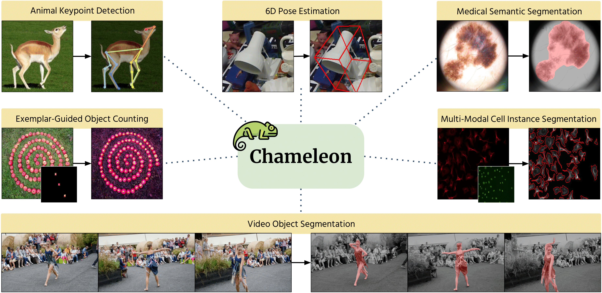

# Mini-Project: Structured Prediction in the Wild

<div align=center>

</img>

</div>

<div align=center>

[](https://colab.research.google.com/github/GitGyun/AIC200-Project-StructuredPrediction/blob/main/chameleon.ipynb)

</div>

- **Presentation Session**: 10/8, in-class
- **Submission Deadline**: 10/8, 23:59 KST
- **Where to Submit**: KLMS

## What to Do

In this project, your goal is to **find a real-world problem that can be framed as structured
prediction in computer vision, and solve it.**

*Structured prediction* means the model's output is not one label per image, but a **dense,
spatially structured field** — a value (or a vector) for every pixel. Segmentation masks, keypoint
heatmaps, depth maps, surface normals, density maps, optical flow and object boundaries are all
structured predictions. The interesting part is that the same machinery solves all of them once
you decide how to encode your problem as a dense output.

### Optional tracks (+2 pt bonus)

On top of the project, you may take on **one, both, or neither** of two optional tracks.

- **Track A — Fine-tuning.** Change the *data and/or the task*: bring new data, define a new dense
  prediction problem, or both; collect or label the data, and fine-tune Chameleon on it yourself,
  with an analysis of how well it works.
- **Track B — System building.** Build a **downstream application** around Chameleon's dense
  predictions (from a released checkpoint or one you fine-tuned yourself), such as conditional
  image generation or a web or mobile app. The system must work end to end, and you evaluate it.

| you do | bonus |
| --- | ---: |
| neither track | 0 pt — but see the minimum requirement below |
| Track A **or** Track B | **+2 pt** (the full bonus) |
| both tracks | +2 pt (the bonus does not stack) |

**If you choose neither track**, your project must at least **apply the generalist model to
real-world data**: run Chameleon (a released checkpoint, e.g. with `predict_image` in the
notebook) on images you collected or found yourself, outside the benchmark datasets, and analyse
the results. Re-running the demo data does not count.

If you do a track, say which one in your write-up and on your first slide. The bar for earning
the bonus is under [Evaluation](#evaluation).

You are free to choose **any problem**, but your project must **use Chameleon for dense
prediction** somewhere in its pipeline. What we care about is:

1. **the problem** — is it a real task that someone would actually want solved?
2. **the formulation** — how did you turn it into a dense prediction, and why is that the right
   encoding?
3. **the data** — how did you get your data and labels?
4. **the results** — does it work, and what do the results tell you?

A few broad directions, to give a sense of range (not a list to pick from):

- an inspection task in industry or agriculture
- a measurement task in science or engineering
- an unusual output space, such as a per-pixel regression target

Every project must use [**Chameleon**](https://arxiv.org/abs/2404.18459) (ECCV 2024 oral), a
few-shot generalist that adapts to an arbitrary dense prediction task from ~20 labelled images, for
dense prediction. As a starting point we provide [`chameleon.ipynb`](chameleon.ipynb), a
walkthrough that makes the "20 labelled images to a working dense predictor" loop fast enough to fit
in one week. Build your project on top of it.

## Getting Started

1. Click **Open in Colab** at the top of this page. The notebook opens directly from GitHub, so
   there is nothing to download or upload.
2. **File → Save a copy in Drive**, so your changes are kept.
3. **Runtime → Change runtime type → T4 GPU.**
4. Open the [shared course folder](https://drive.google.com/drive/folders/1sw2E-ocZmLo5ph9ZdvgHzk7uIhYDndb6?usp=drive_link) (checkpoints and demo data) and add it to your
   Drive: **Add shortcut to Drive → My Drive**. Keep its name, `AIC200-StructuredPrediction`.
5. Run the notebook top to bottom. Its first cells install the dependencies, clone this repository
   for the code, and mount your Drive for the checkpoints and demo data.

The notebook covers:

1. **Input and label format** — every structured-prediction task comes down to the same three
   tensors.
2. **Fine-tuning** — adapting the meta-trained model to one task from 20 labelled images, with the
   training loop written out step by step.
3. **Inference and visualisation** — on five different dense prediction tasks:

   | task | dataset | what the output looks like |
   | --- | --- | --- |
   | Animal keypoint detection | AP-10K | 17 heatmaps, one per joint |
   | Video object segmentation | DAVIS-2017 | one mask per tracked instance |
   | Medical lesion segmentation | ISIC-2018 | one binary mask |
   | Exemplar-guided object counting | FSC-147 | a density map that sums to the count |
   | Cell instance segmentation | Cellpose | two flow channels plus a foreground mask |

4. **Your project and the optional tracks** — a template that reads a folder of images and
   labels, so you can fine-tune on your own problem (Track A); and `predict_image`, which turns a
   loaded model into an *image in, dense map out* function, with an example app and notes on
   generation, web demos, mobile and T4 memory (Track B).

Checkpoints and demo data are distributed through the shared Google Drive folder from step 4.

## IMPORTANT NOTES

PLEASE READ THE FOLLOWING CAREFULLY! Any violation of the rules below will result in **a zero
score**.

- Your code should be **a single `.ipynb` file**. If there are two or more notebook files in your
  final deliverables, the TA will run only one notebook to grade.
- **You must use Chameleon for dense prediction.** A project in which Chameleon never makes a
  dense prediction does not satisfy the assignment.
- **Your output must be a structured (dense) prediction.** A project whose model emits a single
  class label, a bounding box, or a caption does not satisfy the assignment. (A Track B system may
  end in anything, such as an image, an app or a measurement, but a dense prediction must be the
  essential component that makes it work.)
- **Minimum requirement without a track**: if you do neither optional track, you must apply the
  generalist model (Chameleon) to real-world data of your own, not the demo or benchmark datasets
  (see [Optional tracks](#optional-tracks-2-pt-bonus)).
- **Track B apps**: the pipeline (model loading, prediction, and any generation step) must still
  run end to end in your notebook. Code that cannot live in a notebook (a mobile app, a web
  front end) goes in a separate `.zip` (see below) and does not replace the notebook.
- **Every result you submit must come from your own code.** Do not submit outputs produced by an
  external service or by someone else's trained weights presented as your own.
- **List every pretrained weight you use** in your write-up with a source link, starting with the
  Chameleon checkpoint, and any other pretrained model you use alongside it (e.g. the generator in
  a Track B system, or the backbone of a distilled model). Using a pretrained model is expected;
  hiding which one you used is not.
- **Disclose all data.** If you collected or labelled images, say how many and how. If you used an
  existing dataset, name it and link it.
- Running the notebook from start to finish must reproduce your **final results**. Save the
  notebook with the outputs of **all cells included**.

## What to Submit

Submit a single ZIP file named `{STUDENT_ID}_{NAME}_project.zip` containing:

1. **Notebook file**
   - A single `.ipynb` that runs end to end.
   - Saved with all cell outputs included.
2. **Write-up** — a 2–3 page PDF (references do not count toward the page limit) covering:
   - **Problem and motivation**: the real-world task you chose and why it matters.
   - **Formulation**: how you encoded it as a dense prediction — what each output channel means,
     what the label looks like, and what alternatives you rejected.
   - **Data and resources**: your data, how you labelled it, how many examples, and every
     pretrained weight you loaded with its source.
   - **Method and setup**: model, hyperparameters, training and inference settings.
   - **Results and analysis**: qualitative results (demonstration of your system) and any analysis.
   - **If you did Track B — system design and evaluation**: the architecture of your system (which
     component does what), how the dense prediction feeds the rest, and how you evaluated the
     whole: latency, memory, robustness on real inputs, and usefulness.
3. **Presentation slides** — a PDF, PPTX, or Keynote (`.key`) file.
4. **Data (if applicable)** — your images and labels as a single `.zip`, so the TA can reproduce
   your results. If the data is too large, submit a representative subset plus a download link.
5. **App source (Track B, if applicable)** — code that runs outside the notebook (mobile app, web
   front end) as a single `.zip`, with a short README on how to run it. A screen recording is
   welcome.

Use the following naming format:

- **Submission (top-level ZIP):** `{STUDENT_ID}_{NAME}_project.zip`
- **Code:** `{STUDENT_ID}_{NAME}_code.ipynb`
- **Write-up:** `{STUDENT_ID}_{NAME}_writeup.pdf`
- **Presentation slides:** `{STUDENT_ID}_{NAME}_slides.[pdf/pptx/key]`
- **Data (if applicable):** `{STUDENT_ID}_{NAME}_data.zip`
- **App source (Track B, if applicable):** `{STUDENT_ID}_{NAME}_app.zip`

For example, a Track B submission with its own data:

```
20261234_JohnDoe_project.zip
├── 20261234_JohnDoe_code.ipynb
├── 20261234_JohnDoe_writeup.pdf
├── 20261234_JohnDoe_slides.pptx
├── 20261234_JohnDoe_data.zip
└── 20261234_JohnDoe_app.zip
```

## Evaluation

| Component | Points |
| --- | ---: |
| **Mini-project** | **17 pt** |
| └ Write-up | 5 pt |
| └ Presentation (peer review) | 10 pt |
| └ Optional track bonus (Track A or B) | 2 pt |

**Write-up (5 pt)** — 1 pt each for clearly describing:

- Problem and motivation
- Formulation as structured prediction
- Data and resources
- Method and experimental setup
- Results and analysis

**Presentation (10 pt)** — graded entirely by peer review of your in-class presentation (see
[Presentation](#presentation)).

If you do not submit your code, your submitted results cannot be reproduced, or you do not submit
your presentation slides, you will receive **0 out of 17 points** for the entire project. **Late
submissions will not be accepted.**

### Presentation

Each student should prepare a **5-minute presentation** for the session on 10/8 (in class).

- **Slides: up to 6 slides**, submitted to KLMS with the other deliverables by the deadline.
  - **Slide 1:** the problem and your best results.
  - **Remaining slides:** how you formulated it, what data you used, what you tried, and what you
    learned.

Lead with the problem and the result, then explain how you got there.

**Peer review.** Each presentation receives a single **overall score from 1 to 10** from every
other student. When you score, weigh the five criteria below roughly equally. Also note that
doing a track (A or B) is not a plus by itself, as the track bonus is graded separately.

Score guide: 5 = a solid, complete project; 8 = clearly above average; 10 = exceptional.

Scores are normalized per reviewer before averaging, so a reviewer who scores everyone high (or
low) does not shift anyone's grade.

1. **Problem**: Is the target problem a significant, real-world problem?
2. **Task definition and data**: Is the problem well formulated as a dense prediction task? Is the
   data collection and processing pipeline reasonable?
3. **Method**: Is the project technically sound? For Track A, is the fine-tuning process clearly
   described, and does it make sense? For Track B, does the application pipeline make sense?
   Without a track, is the checkpoint applied to the new data in a sensible way?
4. **Results and analysis**: Are the results clearly demonstrated? Is there any in-depth analysis
   (e.g. failure case study)?
5. **Clarity**: Is the presentation clear and within the 5-minute limit? Is the material easy to
   understand?

### Optional Track Bonus (+2 pt)

Completing **either** track earns the full 2 pt; doing both still earns 2 pt, and doing neither
earns no bonus. Without a track, the project must at least apply the generalist model to
real-world data of your own (see above). A track counts as completed when:

- **Track A — Fine-tuning:** you changed the data and/or task (not one of the five demo tasks
  as-is), fine-tuned Chameleon on it yourself, and report its results against held-out labels.
- **Track B — System building:** a working application uses a dense prediction as its essential
  component, runs end to end (the model part in your notebook), and is evaluated beyond a
  demo, e.g. with quality, latency or memory measurements, or a failure case study.

## AI Coding Assistant Tool Policy

**You are allowed (and even encouraged) to use AI coding assistant tools** for this project. Using
them will not be deemed plagiarism. However, it is still **strictly prohibited to directly copy
code from other students**. Doing so will lead to a score of zero and a report to the university.

## Acknowledgements

The starter notebook is built on the official implementation of
[Chameleon: A Data-Efficient Generalist for Dense Visual Prediction in the Wild](https://arxiv.org/abs/2404.18459)
(Kim et al., ECCV 2024). The vendored copy lives in [`chameleon/`](chameleon/); every change we
made to it is documented in [`chameleon/PATCHES.md`](chameleon/PATCHES.md).

```bib
@article{kim2024chameleon,
  title={Chameleon: A Data-Efficient Generalist for Dense Visual Prediction in the Wild},
  author={Kim, Donggyun and Cho, Seongwoong and Kim, Semin and Luo, Chong and Hong, Seunghoon},
  journal={arXiv preprint arXiv:2404.18459},
  year={2024}
}
```
